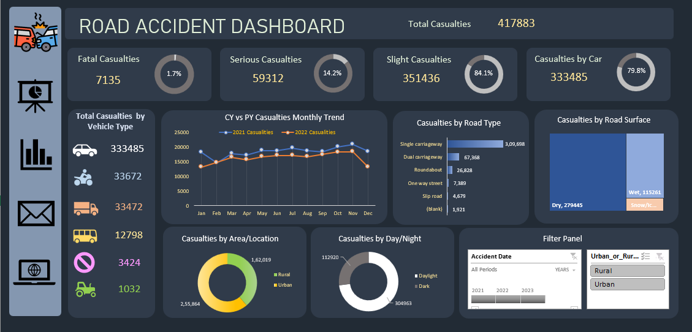

# 🚦 Road Accident Analysis Dashboard

## 📌 Project Overview
This project analyzes **UK Road Accident Data (2021–2022)** to provide actionable insights into accident severity, vehicle involvement, road conditions, and casualty trends.  
The interactive dashboard empowers stakeholders to explore accident patterns and make **data-driven decisions** for road safety improvements.

---

## 🎯 Business Requirements
The client requested a **Road Accident Dashboard** with the following KPIs and insights:

- **Primary KPI**
  - Total Casualties
- **Primary KPIs**
  - Total Casualties & percentage distribution by accident severity
  - Maximum casualties by type of vehicle
- **Secondary KPIs**
  - Casualties by vehicle type
- **Trends**
  - Monthly comparison of casualties (Current Year vs Previous Year)
- **Road & Surface Analysis**
  - Maximum casualties by road type
  - Distribution of casualties by road surface
- **Location & Time Analysis**
  - Relation between casualties by area (Urban/Rural) and by time (Day/Night)

---

## 📊 Dashboard Features
- Interactive filters: **Year, Urban/Rural**
- Navigation links:
  - Dashboard page
  - Data analysis sheet with pivot charts
  - Mail integration
  - UK Accident Wikipedia page
- Visualizations:
  - Line charts for monthly trends
  - Pie charts for area and day/night distribution
  - Bar charts for road surface analysis
  - Tables for vehicle type and severity breakdown

---

## 🔍 Key Insights
- **Total Casualties (2021–2022):** 417,883
- **Severity Distribution:**  
  - Fatal: 1.7%  
  - Serious: 14.2%  
  - Slight: 84.1%
- **Vehicle Involvement:** Cars caused the majority of casualties (79.8%).
- **Trend Analysis:** 2022 reported fewer accidents compared to 2021.
- **Road Type:** Single carriageways had the highest casualties.
- **Road Surface:** Dry surfaces accounted for most accidents.
- **Area:** Urban areas had more accidents than rural.
- **Time:** Daylight accidents were higher compared to night.

---

## 🛠️ Tech Stack
- **Data Source:** UK Road Accident Dataset (2021–2022)
- **Tools Used:**  
  - Microsoft Excel (Data Cleaning, Pivot Tables, Charts)  

---
## 🗂 Profect Files

-data: (https://docs.google.com/spreadsheets/d/1a3MZMwl420pIb_qzLHhc302hLExJMq-D/edit?usp=sharing&ouid=106616877993653454646&rtpof=true&sd=true) 

-excel: (https://docs.google.com/spreadsheets/d/1oVdZbCJ-6ZT1pF7SzhZLru0ZuCpWt_3z/edit?usp=sharing&ouid=106616877993653454646&rtpof=true&sd=true)  

-img: report.png                 

---
## 📸 Dashboard Preview

---

## 📌 Author
**Rose** – Data Analyst in progress, passionate about Excel, SQL, Power BI, and Python.  
Connect with me on [LinkedIn](https://www.linkedin.com/in/rose-ut-a94b1a27b).

---
